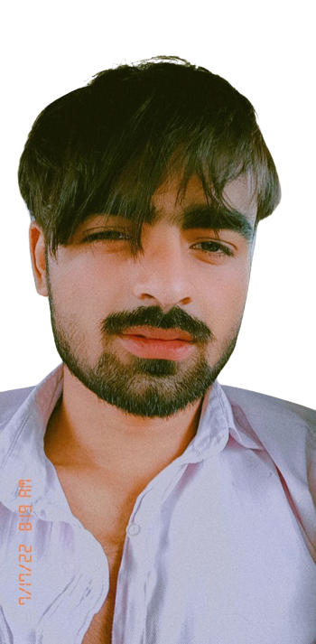
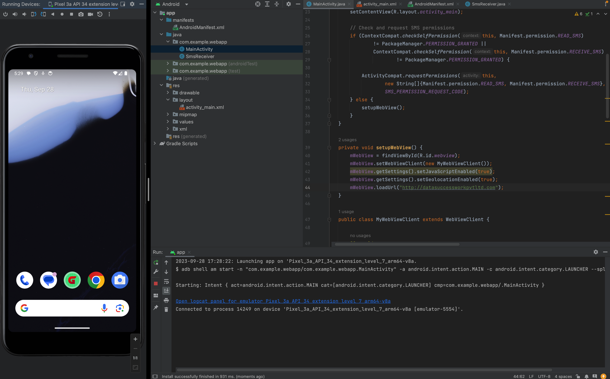
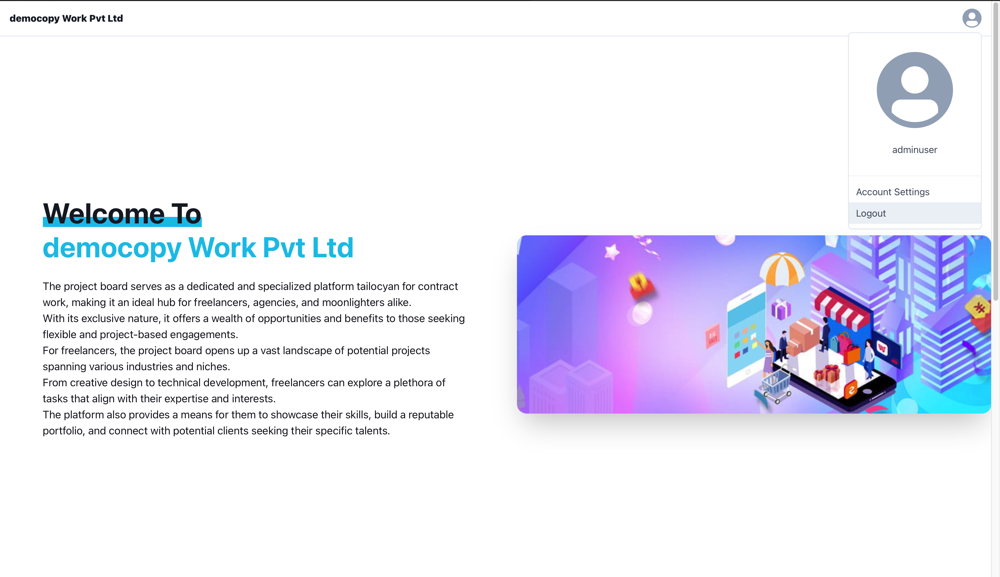
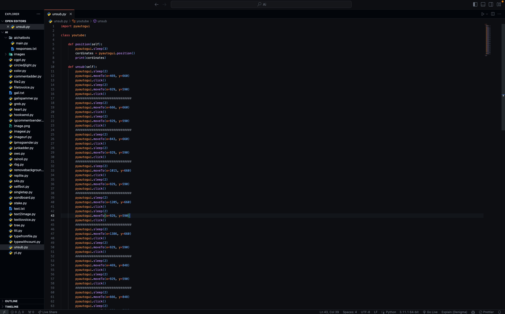
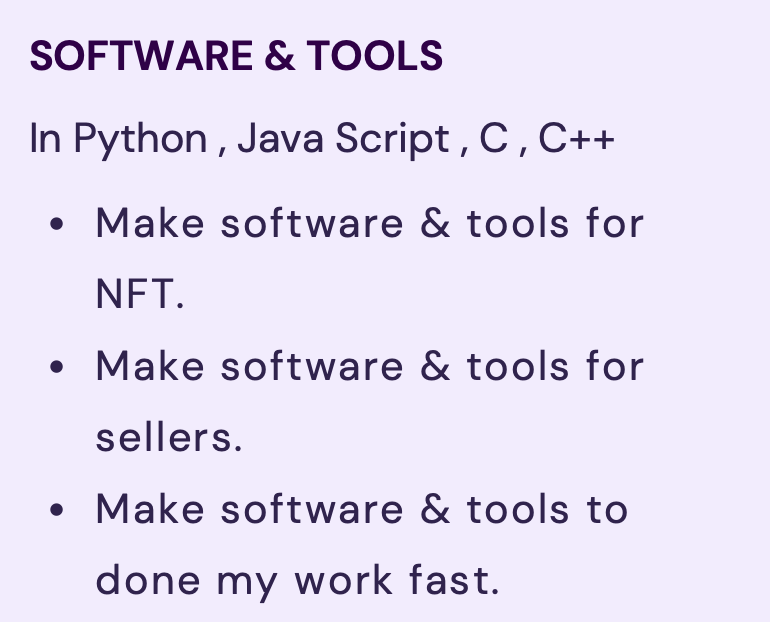
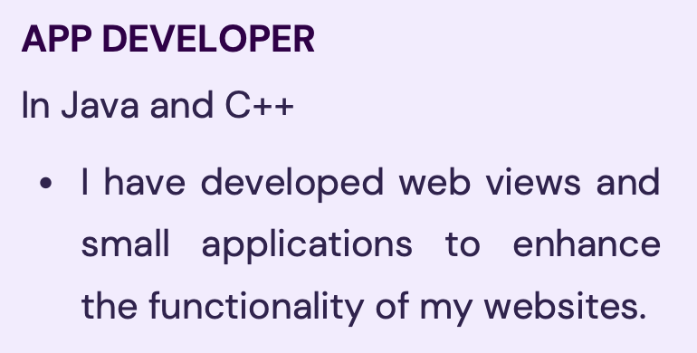

<!DOCTYPE html>
<html>
<head>
  <meta charset="UTF-8">
  
</head>
<body>
  
  <h1 class="profile-title">Hi there! 👋 I'm Harsh Kadyan</h1>
  
I'm a 19-year-old aspiring website developer, andriod app developer, and freelancer. Currently pursuing a BCA degree to expand my technical knowledge and skills.

  <h2>Projects</h2>
  
  
  

  <h2>Work Experience</h2>
  
  
  

  <h2>Skills</h2>
  
  
  
  
  
  

  <h2>Hobbies</h2>
  
  
  

  <h2>Connect with me</h2>
  <a href="http://harshtech.me/">
    
  
  
  

</body>
</html>
